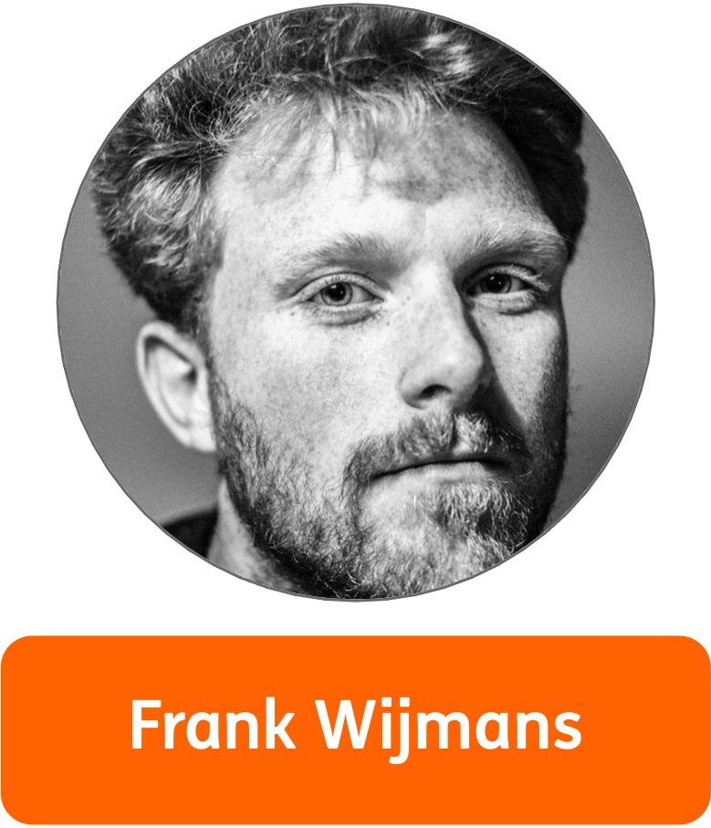
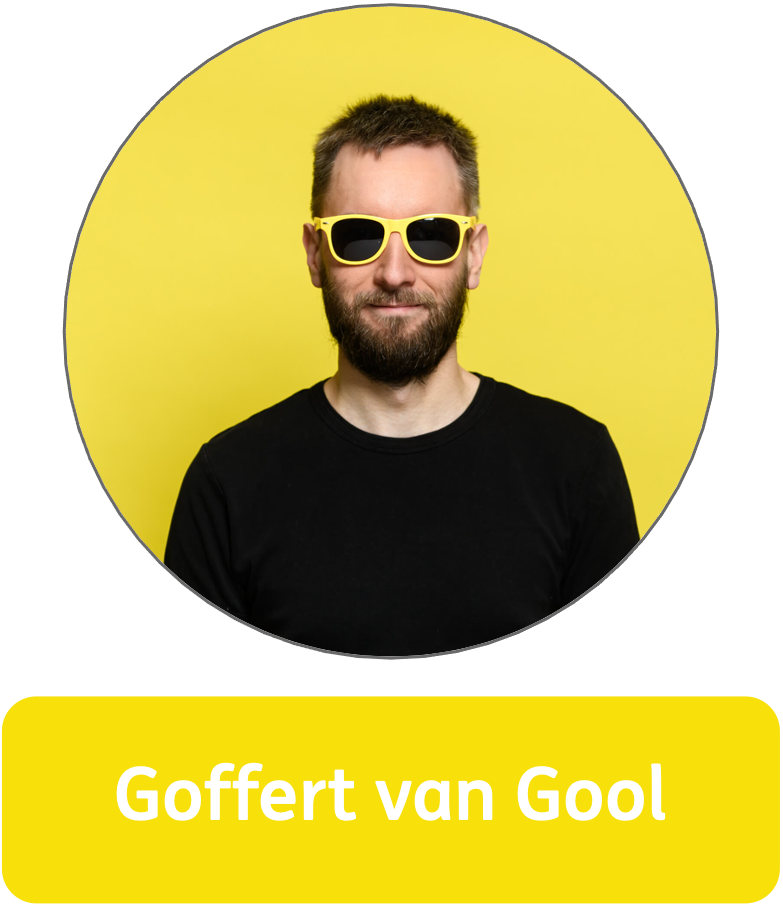
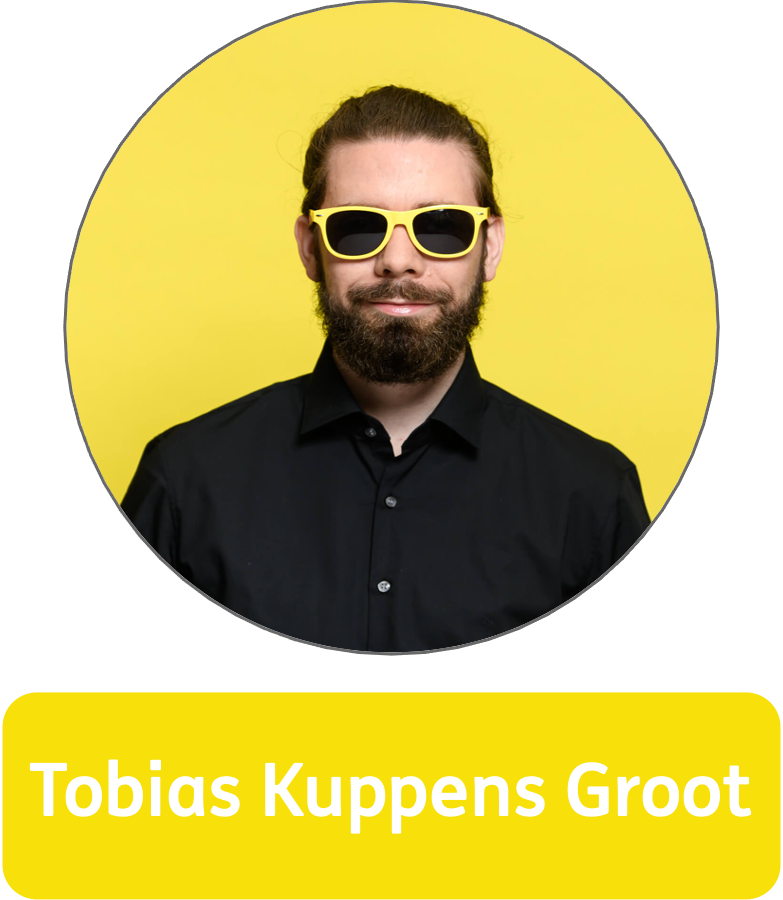

---
# try also 'default' to start simple
theme: seriph
# random image from a curated Unsplash collection by Anthony
# like them? see https://unsplash.com/collections/94734566/slidev
background: https://live.staticflickr.com/5034/5807467500_52abf6b158_n.jpg
# apply any windi css classes to the current slide
class: 'text-center'
# https://sli.dev/custom/highlighters.html
highlighter: shiki
# show line numbers in code blocks
lineNumbers: false
# some information about the slides, markdown enabled
info: |
  ## Open Source Software Meetup
  Presentation slides of the [Open Source Software on meetup.com](https://www.meetup.com/nl-NL/flock-meetups/events/283359253/) held on 28/01/2022.

  "Open-source communities make it possible to learn not only from your own mistakes, but also from those made by others."

  Have you ever heard about open-source and wondered what it was? Or are you curious about the benefits it can bring to you as a developer and to your organisation?
  In this meetup ING's Frank Wijmans and Flock.'s Tobias Kuppens-Groot and Goffert van Gool will explain what open-source is, what it entails, how you can contribute (in the context of software) and whether you should.

  And if you want to read Tobias' blog about open-source, [you can find it here](https://www.linkedin.com/pulse/open-source-flockcommunity-1c/)

And if you want to read Tobias' blog about open-source, you can find it here:
# persist drawings in exports and build
drawings:
  persist: false
---

# Open Source Software Meetup

What is open-source? How to contribute, and whether you should

  <button @click="$slidev.nav.openInEditor()" title="Open in Editor" class="text-xl icon-btn opacity-50 !border-none !hover:text-white">
    <carbon:edit />
  </button>
  <a href="https://github.com/slidevjs/slidev" target="_blank" alt="GitHub"
    class="text-xl icon-btn opacity-50 !border-none !hover:text-white">
    <carbon-logo-github />
  </a>

---
layout: full
---

# Introduction

Contributors

---
layout: image-right
image: https://live.staticflickr.com/5034/5807467500_52abf6b158_n.jpg
---
# Introduction

Outline

- The meaning of open-source
- Open-source at your workplace
- How the open-source software eco-system works
- Common contribution workflow with Git
- How does open-source contributions look?
- But is it something for you?
- The good, the bad, the ugly and the noteworthy

---
layout: image
image: https://live.staticflickr.com/5034/5807467500_52abf6b158_n.jpg
---

<h1 class="my-auto">The meaning of open-source</h1>

---
layout: image-left
image: https://live.staticflickr.com/5034/5807467500_52abf6b158_n.jpg
---

# What can be open-source?

the sky is the limit

<v-clicks>

- open-source is a concept
- can be applied to everything
- not limited to software

However, we will focus on open-source software.

</v-clicks>

<!--
Technically speaking there isn't any limitation what can or cannot be open source. It is a concept that can be applied to everything. However, we focus on contributing to open-source software. But before we do that, let's have a look at closer look on what open-source means and how it
-->

---
layout: full
---

# What is open-source?

- code is published on a public space
- enabled cooperation
- easily extendable and redistributable

# Common fallacies

- no control over your work
- open-source means free
- open-source is unsafe

---
layout: image-right
image: https://live.staticflickr.com/5034/5807467500_52abf6b158_n.jpg
---

# Open-source at your workplace

enable developers to work on open-source software

giving developers time during workings hours to contribute to open-source benefits all

- every tech company uses open-source software
- technological exchange
- improved skills
- problem solving outside the tech stack
- apply inner-sourcing within the company

---
src: slides/git-eco-system.md
---

---
src: slides/ruphin-slides-open-source-workshop/00-cover-deck-git.md
---
---
src: slides/ruphin-slides-open-source-workshop/01.md
---
---
src: slides/ruphin-slides-open-source-workshop/02.md
---
---
src: slides/ruphin-slides-open-source-workshop/03.md
---
---
src: slides/ruphin-slides-open-source-workshop/04.md
---
---
src: slides/ruphin-slides-open-source-workshop/05.md
---
---
src: slides/ruphin-slides-open-source-workshop/06.md
---
---
src: slides/ruphin-slides-open-source-workshop/07.md
---
---
src: slides/ruphin-slides-open-source-workshop/08-cover-deck-collaboration.md
---
---
src: slides/ruphin-slides-open-source-workshop/09.md
---
---
src: slides/ruphin-slides-open-source-workshop/10-cover-deck-access-control.md
---
---
src: slides/ruphin-slides-open-source-workshop/11.md
---
---
src: slides/ruphin-slides-open-source-workshop/12-cover-deck-pull-requests.md
---
---
src: slides/ruphin-slides-open-source-workshop/13.md
---
---
src: slides/ruphin-slides-open-source-workshop/14-cover-deck-forks.md
---
---
src: slides/ruphin-slides-open-source-workshop/15.md
---
---
src: slides/ruphin-slides-open-source-workshop/16.md
---
---
src: slides/ruphin-slides-open-source-workshop/17.md
---
---
src: slides/ruphin-slides-open-source-workshop/18.md
---
---
src: slides/ruphin-slides-open-source-workshop/19.md
---
---
src: slides/ruphin-slides-open-source-workshop/20.md
---
---
src: slides/ruphin-slides-open-source-workshop/21-cover-deck-licenses.md
---
---
src: slides/ruphin-slides-open-source-workshop/22.md
---
---
src: slides/ruphin-slides-open-source-workshop/23-cover-deck-issues.md
---
---
src: slides/ruphin-slides-open-source-workshop/24.md
---
---
src: slides/ruphin-slides-open-source-workshop/25-cover-deck-workflow.md
---
---
src: slides/ruphin-slides-open-source-workshop/26.md
---
---
src: slides/git-common-workflow.md
---
---
src: slides/experience.md
---
---
src: slides/open-source-for-you.md
---

---
layout: intro
---

# The good, the bad, the ugly and the noteworthy

Where there is light, there must be shadow.

<!--
The world of open-source is cool and exciting.
Where there is is light, there must be shadow.

There is something to say about what is really good about the eco-system of open-source software. The benefits are numerous.

The same holds true for the bad.

And occasionally the ugly arises

We created a collection of noteworthy open-source
-->

---
layout: image-right
image: https://live.staticflickr.com/5034/5807467500_52abf6b158_n.jpg
---

# The good

learning and experience

- knowledge sharing
- learning from open source repositories
- helping and improving other projects with your expertise
- broaden the perspective
- satisfying to do
- get inspired
- use [code-review clubs](https://media.ccc.de/v/rc3-2021-cwtv-228-lets-review-code-toget#t=0) to reduce complexity

<!--
-->

---
layout: image-right
image: https://live.staticflickr.com/5034/5807467500_52abf6b158_n.jpg
---

# The bad

difficult and time consuming

- very time consuming
- slow
- requires persistence
- steep learning curve
- chat-like discussions are difficult
- good first issues requires a lot of knowledge

---
layout: image-right
image: images/dependency_2x.png
---

# The ugly

Welcome to the dark side of open-source software

- low payment for contributors
- log4j
- color.js, faker.js

<!--
open source software is vulnerable to capitalistic exploits

-->

---
layout: full
---

# The noteworthy

This is good to know

- [nlNet foundation](https://nlnet.nl/)
  - financially supporting organizations and people that contribute to an open information society
- [Bug bounty program 2022](https://ec.europa.eu/info/news/european-commissions-open-source-programme-office-starts-bug-bounties-2022-jan-19_en) of the [European Commission Open-Source Software strategy](https://ec.europa.eu/info/departments/informatics/open-source-software-strategy_en)
  - an amount of EUR 200,000 was funded by the European Commission Open Source Programme Office (EC OSPO) to focus again on the security of open source software widely used by public services.
- [EU open source policy summit 2022](https://summit.openforumeurope.org/)
  - February 4
  - Open Source & the Grand Challenges
- [FOSDEM 22](https://fosdem.org/2022/)
  - 5 & 6 February 2022
  - Every year, thousands of developers of free and open source software from all over the world gather at the event

<!--
The European Commission released a bug bounty program featuring various open-source projects which are frequently used within the EU. You can get more details
-->

---
layout: full
---

# Resources

- Title image: "Portland street public water fountain" by Dominick Guzzo is licensed under CC BY-NC-SA 2.0

- https://xkcd.com/2347/ used
- code review club: https://media.ccc.de/v/rc3-2021-cwtv-228-lets-review-code-toget#t=0
- nlNet foundation: https://nlnet.nl/
- EU OSPO Bug bounty program : https://ec.europa.eu/info/news/european-commissions-open-source-programme-office-starts-bug-bounties-2022-jan-19_en
- EU OSSS: https://ec.europa.eu/info/departments/informatics/open-source-software-strategy_en
- EU open source policy summit 2022: https://summit.openforumeurope.org/
- FOSDEM 2022: https://fosdem.org/2022/
- log4j problem: https://thenextweb.com/news/log4j-bug-internet-open-source-contributors-analysis
- color.js and faker.js incident: https://fossbytes.com/developer-corrupts-faker-js-and-color-js/
- github access trade-ban:
  - https://www.linux.com/news/github-block-developers-countries-facing-us-trade-sanctions/
  - https://www.zdnet.com/article/github-starts-blocking-developers-in-countries-facing-us-trade-sanctions/

---
layout: image
image: https://live.staticflickr.com/5034/5807467500_52abf6b158_n.jpg
---

<h1 class="absolute top-24 right-40">Thank you!</h1>
<h2 class="absolute top-48 right-40">Any Questions?</h2>

---
layout: end
---
